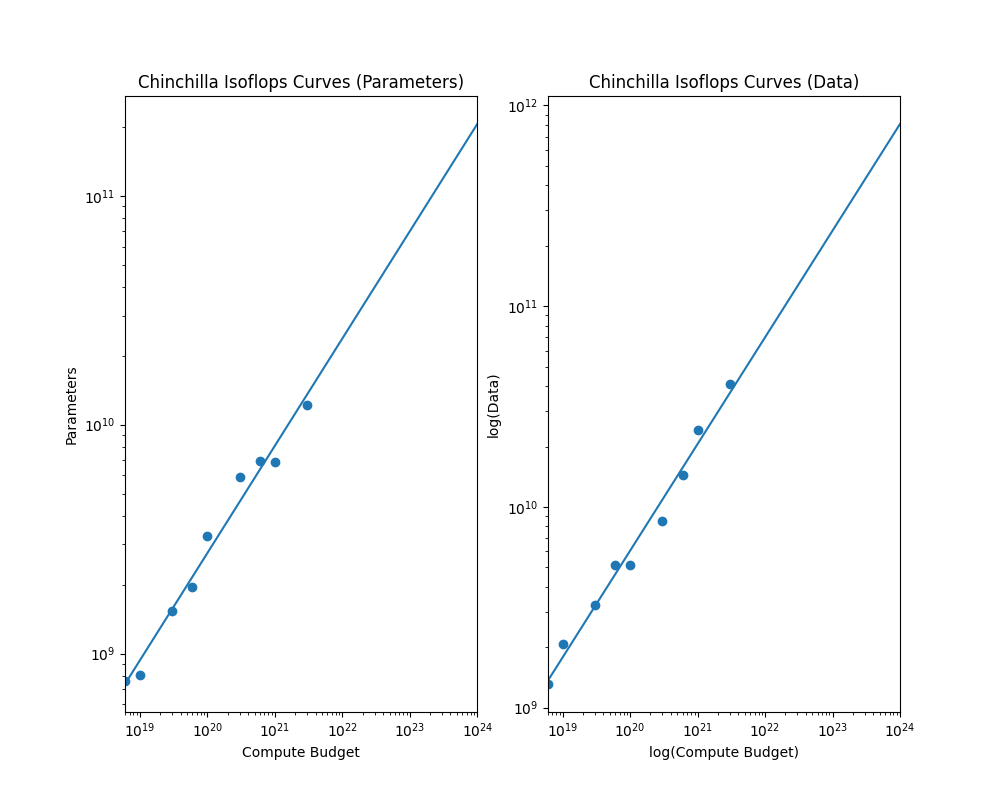

# Problem (chinchilla_isoflops)

> Write a script to reproduce the IsoFLOPs method describe above for fitting scaling laws using
> the final training loss from a set of training runs. For this problem, use the (synthetic) data from
> training runs given in the file data/isoflops_curves.json. This file contains a JSON array, where
> each element is an object describing a training run. Here are the first two runs for illustrating the
> format:
```json
[
{
"parameters": 49999999,
"compute_budget": 6e+18,
"final_loss": 7.192784500319437
},
{
"parameters": 78730505,
"compute_budget": 6e+18,
"final_loss": 6.750171320661809
},
...
```

> For fitting the scaling laws, the scipy package (and scipy.optimize.curve_fit in particular)
> might be useful, but you’re welcome to use any curve fitting method you’d like. While Hoffmann et al.
> [2022] fits a quadratic function to each IsoFLOP profile to find its minimum, we instead recommend
> you simply take the run with the lowest training loss for each compute budget as the minimum.

**Conclusion:** 

$$
N \propto C^{.47} \qquad \text{ and } \qquad D \propto D^{.53}
$$



## Question 1

> Show your extrapolated compute-optimal model size, together with the ⟨Ci, Nopt(Ci)⟩ points you
> obtained. What is your predicted optimal model size for a budget of 1023 FLOPs? What about
> for 1024 FLOPs?

> Deliverable: A plot showing your scaling law for model size by compute budget, showing the
> data points used to fit the scaling law and extrapolating up to at least 1024 FLOPs. Then, a
> one-sentence response with your predicted optimal model size.

```bash
Training set (N, C):
6e+18 762093419
1e+19 806647749
3e+19 1536852354
6e+19 1952041776
1e+20 3253402960
3e+20 5903836027
6e+20 6971055968
1e+21 6859328563
3e+21 12148905329
N = b*C^a
N = 1.1634106390845635*C^0.4686826676941816
Optimal exponent:  0.4686826676941816
Multiplicative factor:  1.1634106390845635
Predicted optimal dataset size for $10^{23}$ FLOPs:  206.11853909307536 T
Predicted optimal dataset size for $10^{24}$ FLOPs:  206.11853909307536 T
```

##Question 2
>  Show your extrapolated compute-optimal dataset size, together with the ⟨Ci, Dopt(Ci)⟩ data
> points from the training runs. What is your predicted optimal dataset size for budgets of 1023
> and 1024 FLOPs?

> Deliverable: A plot showing your scaling law for dataset size by compute budget, showing the
> data points used to fit the scaling law and extrapolating up to at least 1024 FLOPs. Then, a
> one-sentence response with your predicted optimal dataset size.

```bash
Training set (D, C):
6e+18 1312175089.1277542
1e+19 2066164157.4439783
3e+19 3253402961.5703735
6e+19 5122841182.472726
1e+20 5122841182.472726
3e+20 8469069901.558091
6e+20 14345028996.903902
1e+21 24297810658.27429
3e+21 41155971378.46459
D = b*C^a
D = 0.14325697063502404*C^0.5313173300882201
Optimal exponent:  0.5313173300882201
Multiplicative factor:  0.14325697063502404
Predicted optimal dataset size for $10^{23}$ FLOPs:  808.5961799860999 B
Predicted optimal dataset size for $10^{24}$ FLOPs:  808.5961799860999 B
```